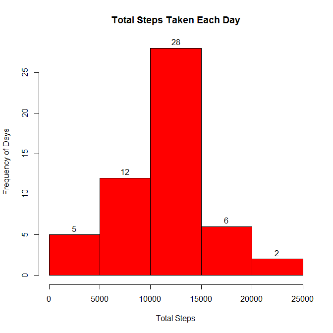
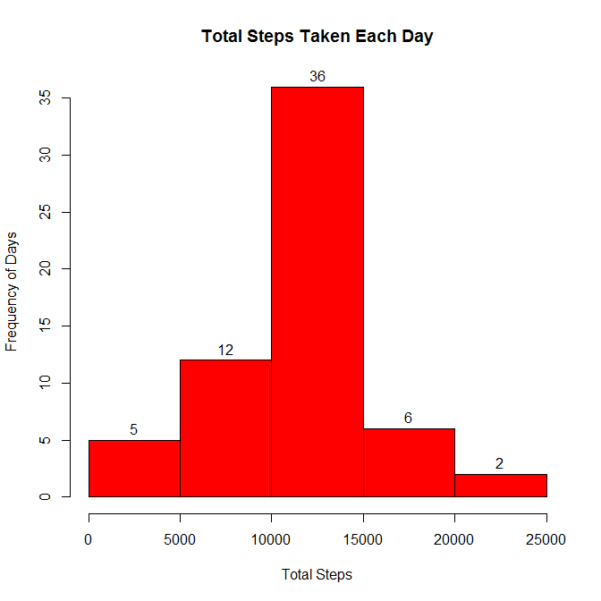
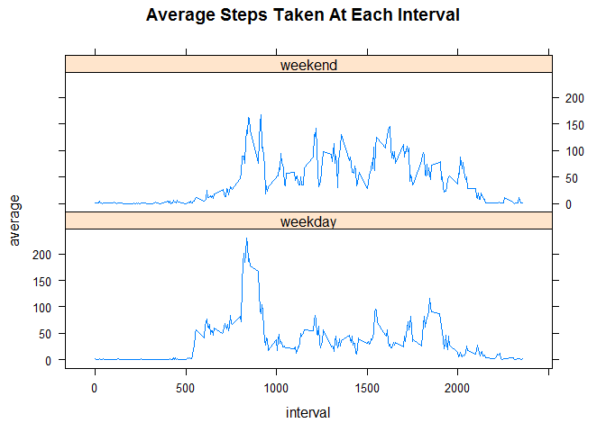

# Reproducible Research: Peer Assessment 1


## Loading and preprocessing the data
The first step is to read in the data. We use the following code to unzip the file and read in the csv. In addition, after taking a look at the actual csv file, we realize it is possible to go ahead and set the column classes using the ```colClasses()``` argument.

```r
data <- read.table(unz("activity.zip", "activity.csv"), 
                   header=TRUE, sep=",",stringsAsFactors=FALSE,
                   colClasses = c("numeric","Date","numeric"))
```
By using the ```colClasses()``` argument, we went ahead and transformed our data so now it is ready to begin performing our analysis.  

## What is mean total number of steps taken per day?
For this step we want to make a histogram of the total number of steps taken each day. Currently the data shows the number of steps taken at every 5-minute interval throughout the day as you can see here:

```r
head(data)
```

```
##   steps       date interval
## 1    NA 2012-10-01        0
## 2    NA 2012-10-01        5
## 3    NA 2012-10-01       10
## 4    NA 2012-10-01       15
## 5    NA 2012-10-01       20
## 6    NA 2012-10-01       25
```
  
  
We want to know the total number of steps taken each day, which is easy to do using the **plyr** package. Also note that at this point we want to remove any `NA`s from our data. So let's first create a new data frame with all of the `NA`s removed, where we will store the daily sums.

```r
daySums <- data[!is.na(data$steps),]
```
  
  
You can see now all of the `NA`s have been removed from the steps column

```r
sum(is.na(daySums$steps))
```

```
## [1] 0
```

```r
head(daySums,5)
```

```
##     steps       date interval
## 289     0 2012-10-02        0
## 290     0 2012-10-02        5
## 291     0 2012-10-02       10
## 292     0 2012-10-02       15
## 293     0 2012-10-02       20
```
  
  
Now we can use the **plyr** package to calculate the total number of steps taken each day. The following line of code says that within our daySums data frame, summarize the data by calculating the sum of the number of steps across each date.

```r
library(plyr)
daySums <- ddply(daySums,~date,summarize,sum=sum(steps))
```
  
  
Our daySums data frame has been transformed and now only has two columns. The date and the total number of steps. Let's have a look:

```r
head(daySums)
```

```
##         date   sum
## 1 2012-10-02   126
## 2 2012-10-03 11352
## 3 2012-10-04 12116
## 4 2012-10-05 13294
## 5 2012-10-06 15420
## 6 2012-10-07 11015
```
  
  
Sweet! We can also compare how many days were completely missing data using the following lines of code.

```r
length(unique(data$date)) #how many unique dates are there in our original data?
```

```
## [1] 61
```

```r
length(daySums$date) #how many dates are there in our daySums data frame?
```

```
## [1] 53
```
So there were 8 days that had all `NA` values.
  
  
Now let's make a histogram of the total number of steps taken each day, using the base plotting package.

```r
with(daySums,hist(sum,col="red",main="Total Steps Taken Each Day",xlab="Total Steps",ylab = "Frequency of Days",labels=TRUE))
```

 
  
  
Great! Now what if we want to know the **mean** and **median** values for the total number of steps taken each day? Easy!

```r
mean(daySums$sum)
```

```
## [1] 10766.19
```

```r
median(daySums$sum)
```

```
## [1] 10765
```

## What is the average daily activity pattern?
Now we want to see a plot that shows us at each 5-minute interval (x-axis), the average number of steps taken, averaged across all days (y-axis). Let's again create a new data frame to store our results, again removing any `NA` values.

```r
intAvg <- data[!is.na(data$steps),]
```
  
  
We can again use the **plyr** package, with just a few minor tweaks. This time we tell it that within our `intAvg` data frame, summarize the data by calculating the average number of steps taken across each interval.

```r
intAvg <- ddply(intAvg,~interval,summarize,average=mean(steps))
```
  
  
Now our `intAvg` data frame has been transformed to show only two columns, the interval and the average number of steps taken

```r
head(intAvg)
```

```
##   interval   average
## 1        0 1.7169811
## 2        5 0.3396226
## 3       10 0.1320755
## 4       15 0.1509434
## 5       20 0.0754717
## 6       25 2.0943396
```
  
  
We can use this data to make our plot, placing the interval on the x-axis and the average on the y-axis:

```r
with(intAvg,plot(interval,average,type="l",
                 main="Average Steps Taken Per Interval" ,ylab="Average Steps",xlab="Interval"))
```

 
  
  
What if we want to know which interval has the highest number of average steps taken? The ```which()``` function allows us to do this. The following code creates a variable that tells us which row in our `intAvg` data frame has the highest average, then returns that row:

```r
maxRow <- which(intAvg$average == max(intAvg$average))
maxRow #return the row
```

```
## [1] 104
```

```r
intAvg[maxRow,]  #return that row of our data frame
```

```
##     interval  average
## 104      835 206.1698
```
So interval 835 has the highest number of average steps taken at 206.1698113 steps  

## Imputing missing values
As we realized in the beginning of our analysis, there are a number of data points containing missing values. Let's find out exactly how many there are:

```r
sum(is.na(data$steps))
```

```
## [1] 2304
```
We can see there are 2304 missing values. We want to impute those values so that we can get as broad of a picture of our data as possible. One way to do this would be to replace the `NA` value for a particular interval with whatever the average number of steps taken for that interval is. We already computed this data earlier in our `intAvg` data frame. First let's create a new data frame so that we can compare to the original when we are done.

```r
imputedData <- data
```
  Now let's create a function that will take an interval as its input, and return the average number of steps taken for that interval from the `intAvg` data frame. This function essentially says to find which row in the `intAvg` data frame contains the interval we passed to the function, and returns the average for that interval (which is in the "average" column).

```r
returnIntAvg <- function(interval){
        avg <- intAvg[which(interval == intAvg$interval),"average"]
        avg      
}
```
  We can set all of our missing values using this function. The following code uses `sapply()` to accomplish this. We pass `sapply()` the vector of intervals for all of the entries with missing steps, and run the `returnIntAvg()` function on those intervals. A vector of averages gets returned, which we assign to the missing `steps` values.

```r
imputedData[is.na(imputedData$steps),"steps"] <- sapply(imputedData[is.na(imputedData$steps),"interval"],returnIntAvg)
```
  Now let's see if there are any `NA`s left.

```r
sum(is.na(imputedData$steps))
```

```
## [1] 0
```
All gone!

  Now let's create a new histogram using our ```imputedData``` data frame, and calculate the **mean** and **median** values. First we need to calculate the total number of steps taken per day, again using `ddply()` from the **plyr** package.

```r
imputedSums <- ddply(imputedData,~date,summarize,sum=sum(steps))
with(imputedSums,hist(sum,col="red",main="Total Steps Taken Each Day",xlab="Total Steps",ylab= "Frequency of Days",labels=TRUE))
```

 

```r
#calculate mean and median
mean(imputedSums$sum)
```

```
## [1] 10766.19
```

```r
median(imputedSums$sum)
```

```
## [1] 10766.19
```

Now we can compare the means and medians between our data sets:

```r
summaryTable <- data.frame("data" = c(mean(daySums$sum),median(daySums$sum)), 
                           "imputedData" = c(mean(imputedSums$sum),median(imputedSums$sum)),
                           row.names=c("mean","median"))
summaryTable
```

```
##            data imputedData
## mean   10766.19    10766.19
## median 10765.00    10766.19
```

We can see that the mean is actually the same and the median has increased slightly. Since we used the mean values for imputing our missing data, it doesn't change our overall mean/median estimates very much (in fact it does not change the mean at all). Let's see how the total number of steps has changed by imputing missing data.

```r
sum(daySums$sum)
```

```
## [1] 570608
```

```r
sum(imputedSums$sum)
```

```
## [1] 656737.5
```

The total number of steps recorded increases by 86129.5 steps when we include the imputed data. 

## Are there differences in activity patterns between weekdays and weekends?
Now we want to see whether there is difference in activity patterns between weekdays and weekends. The first step to complete in order to do this is to create a factor variable that will tell us what type of day it was for each data point. Let's start by creating a new column and using the `weekdays()` function to at least get the day of the week. 

```r
imputedData$dayType <- weekdays(imputedData$date)
head(imputedData)
```

```
##       steps       date interval dayType
## 1 1.7169811 2012-10-01        0  Monday
## 2 0.3396226 2012-10-01        5  Monday
## 3 0.1320755 2012-10-01       10  Monday
## 4 0.1509434 2012-10-01       15  Monday
## 5 0.0754717 2012-10-01       20  Monday
## 6 2.0943396 2012-10-01       25  Monday
```
Heading in the right direction. Now let's create a function that will take a day as its input and then convert it to either "weekend" or "weekday" depending on which it is. 

```r
convertDays <- function(day){
        if(day == "Saturday" | day == "Sunday"){
                day <- "weekend"
        } else{
                day <- "weekday"
        }
}
```
Now we can use `sapply()` to run our `convertDays()` function on the vector of all days in our `imputedData$dayType` column. Using `sapply()` will return a vector telling us the type of day it is, which we will use to overwrite the existing values.

```r
imputedData$dayType <- sapply(imputedData$dayType,convertDays)
head(imputedData)
```

```
##       steps       date interval dayType
## 1 1.7169811 2012-10-01        0 weekday
## 2 0.3396226 2012-10-01        5 weekday
## 3 0.1320755 2012-10-01       10 weekday
## 4 0.1509434 2012-10-01       15 weekday
## 5 0.0754717 2012-10-01       20 weekday
## 6 2.0943396 2012-10-01       25 weekday
```
Awesome! Now let's make a time series plot of the 5-minute interval (x-axis) and the average number of steps taken, averaged across all weekday days or weekend days (y-axis).  

First we need to convert our `dayType` column into a factor, which will allow us to show a plot for each type of day. 

```r
imputedData$dayType <- as.factor(imputedData$dayType)
```

Then we need to calculate the average number of steps taken at each interval for both weekdays and weekends. We can do this using `ddply()`, telling it to summarize the data by giving us the mean number of steps taken across both interval and dayType.

```r
imputedAvg <- ddply(imputedData,c("interval","dayType"),summarize,average=mean(steps))
head(imputedAvg)
```

```
##   interval dayType    average
## 1        0 weekday 2.25115304
## 2        0 weekend 0.21462264
## 3        5 weekday 0.44528302
## 4        5 weekend 0.04245283
## 5       10 weekday 0.17316562
## 6       10 weekend 0.01650943
```

You can see there are two entries for each interval, one for weekdays and one for weekends, which is just what we wanted. Now let's create our chart using the lattic package. We tell it that we want to show the average at each interval, segregated by dayType using `average~interval | dayType`:

```r
library(lattice)
xyplot(average~interval | dayType, data = imputedAvg, type="l",layout=c(1,2),main="Average Steps Taken At Each Interval")
```

 

We did it!
